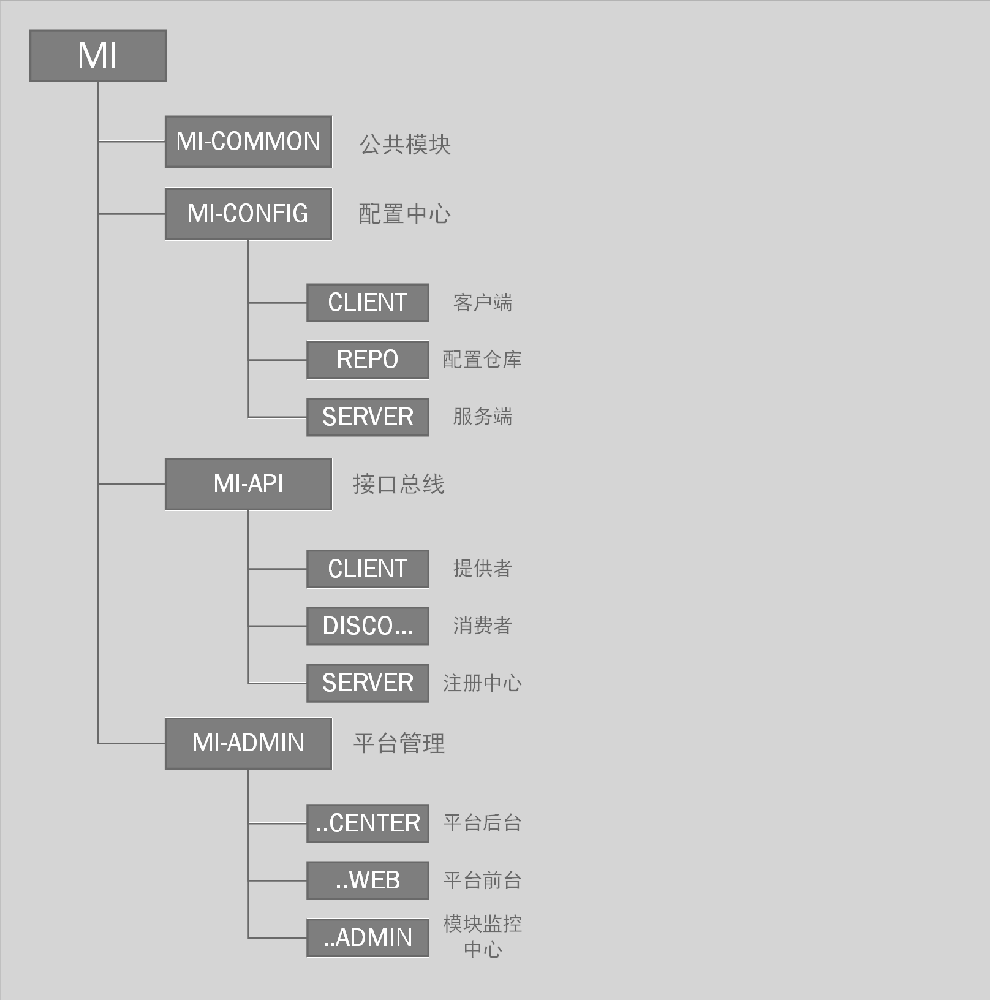

# MI

## 作者前言

   希望大家一起共同研究。更多的解决方法。 联系方式见点击上边的License即可。
   由于本人非技术大牛，业务时间较少。但是保证不定期更新。若有较好的意见或者建议提问到ISSUES

## 项目规划

   `MI`微型系统项目于2017年4月1日按照企业习惯归纳总结出自己一套企业级架构，并仅仅只是架构，它是一种理念，正在成长中.....

## 项目介绍

　　基于 **Spring Boot** + **Spring Cloud** + **Mybatis** 为主流框架搭建的分布式敏捷开发系统架构，为中、小型项目打造企业级基础开发解决方案。

#### 结构图解

#### 模块简介

> mi-admin

平台总管理，提供模块运行环境、日志等监控。以及总平台管理中心功能。（待设计中）

> mi-api

接口总线服务模块，提供eureka注册中心。其他模块需暴露API接口可参考此案例。

> mi-app

移动端相关模块

> mi-common

框架公共模块，提供相关共用工具类，以及代码生成器，基础配置参数，静态变量等。

> mi-config

分布式统一配置管理中心

## 环境搭建

#### 开发工具与环境
- **IntelliJ IDEA Version(2017.1)**
- **MySQL**  
- **Navicat** 
- **Jdk 8**
- **Redis**
- **Microsoft Visio**
- **Power Designer**
- **Git**

## 技术选型

#### 前端技术
技术 | 名称 | 官网
----|------|----
Editor.md | Markdown编辑器  | [https://github.com/pandao/editor.md](https://github.com/pandao/editor.md)
Select2 | 选择框插件  | [https://github.com/select2/select2](https://github.com/select2/select2)

#### 后端技术
技术 | 名称 | 官网
----|------|----
Spring Boot | 微框架  | [https://projects.spring.io/spring-boot/](https://projects.spring.io/spring-boot/)
Spring Cloud | 微服务构架（中文）  | [https://springcloud.cc/](https://springcloud.cc/)
Spring Boot Admin | 应用监控中心V1.5.0  | [http://codecentric.github.io/spring-boot-admin/1.5.0/](http://codecentric.github.io/spring-boot-admin/1.5.0/)
Spring Security | 安全框架  | [http://projects.spring.io/spring-security/](http://projects.spring.io/spring-security/)
Maven | 项目构建管理  | [http://maven.apache.org/](http://maven.apache.org/)
Redis | 分布式缓存数据库  | [https://redis.io/](https://redis.io/)
Eureka | 云端服务发现  | [https://springcloud.cc/spring-cloud-netflix-zhcn.html/](https://springcloud.cc/spring-cloud-netflix-zhcn.html/)
Swagger2 | API文档框架  | [http://swagger.io/](http://swagger.io/)
MyBatis | ORM框架  | [http://www.mybatis.org/mybatis-3/zh/index.html/](http://www.mybatis.org/mybatis-3/zh/index.html/)
MyBatis Generator | 代码生成  | [http://www.mybatis.org/generator/index.html/](http://www.mybatis.org/generator/index.html/)
MyBatis-Plus | Mybatis增强工具包  | [http://mp.baomidou.com/#//](http://mp.baomidou.com/#//)
Druid | 数据库连接池 | [https://github.com/alibaba/druid/](https://github.com/alibaba/druid/)
Log4J | 日志组件 | [https://logging.apache.org/log4j/2.x/](https://logging.apache.org/log4j/2.x/)
Velocity | 模板引擎 | [http://velocity.apache.org/](http://velocity.apache.org/)

## 解决问题
                
+ **部署问题**
    +  **从git上克隆下来的时候项目pom.xml文件是xml格式请根据自己的编译器转换格式**
        
        IDEA:选择pom右键--->+Add as Maven Project 稍等即可
     
    + **首先若使用MI-API模块案例 先启动注册中心、服务提供者、消费者。**
